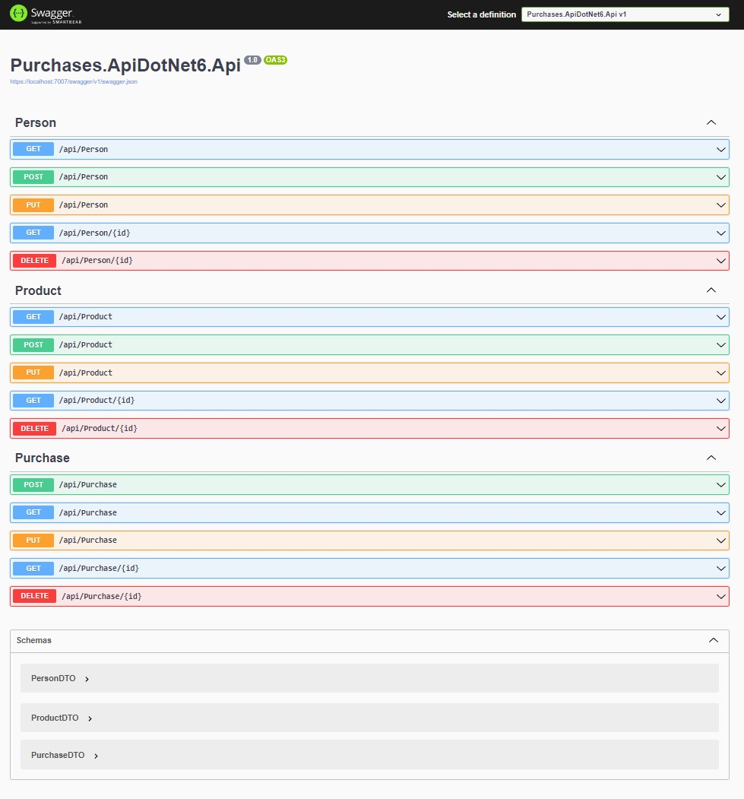

# Purchases.ApiDotNet6

## Tabela de conteúdos

- [Purchases.ApiDotNet6](#purchasesapidotnet6)
  - [Tabela de conteúdos](#tabela-de-conteúdos)
  - [Visão Geral](#visão-geral)
    - [O Projeto](#o-projeto)
    - [Captura de Tela](#captura-de-tela)
    - [Recursos utilizados](#recursos-utilizados)
  - [Pré-requisitos](#pré-requisitos)
    - [Criação do Banco de dados](#criação-do-banco-de-dados)
    - [Inicialização da API](#inicialização-da-api)
  - [Autor](#autor)
  
## Visão Geral

### O Projeto

Back end criado com Asp.net Core com Entity Framework que manipula os dados no banco de dados SqlServer e gera uma API onde será possível o front end interagir com o usuário para realizar as operações básicas na aplicação.

A API consiste em realizar todas as operações comuns de um CRUD (create, read, update, delete) e validações necessárias para pessoa, produto e compras.

Para cadastrar uma compra é necessário ter pessoas e produtos cadastrados, pois são necessários o `codErp` do produto e `documento` da pessoa para vincular a venda.

### Captura de Tela

### Recursos utilizados

- [Asp.Net Core](https://learn.microsoft.com/pt-br/dotnet/core/introduction) - é uma plataforma de desenvolvedor multiplataforma de código aberto gratuita para criar muitos tipos de aplicativos.
- [Entity Framework](https://learn.microsoft.com/pt-br/ef/) - é um mapeador moderno de banco de dados de objeto para .NET.
- [SQL Server](https://www.microsoft.com/pt-br/sql-server/) - banco de dados.

## Pré-requisitos

É necessário estar instalado:

- Visual Studio 2022
- Microsoft SQL Server 2019

### Criação do Banco de dados

Para criarmos o banco de dados será necessário abrir o Microsoft SQL Server Tools e na aba Banco de Dados criar um novo com o nome `DbPurchase`

Logo após execute este script no banco para criar todas as tabelas necessárias.

- [Script Banco de Dados](./creat-database.sql)
  
### Inicialização da API

Após iniciarmos o Visual Studio 2022, devemos seguir as seguintes etapas para executar a API:

- Abrir o projeto contido na pasta StudentApi.

- Devemos encontrar o arquivo `appsettings.json` e alterarmos o `DefaultConnection` para a string de conexão correta do banco de dados instalado.
  
- Executar a aplicação.

Assim será montado nossa API e exibida uma página do SwaggerUI mostrando os endpoints disponíveis.

## Autor

Portfólio - [danilocalegaro.dev.br](https://danilocalegaro.dev.br/)